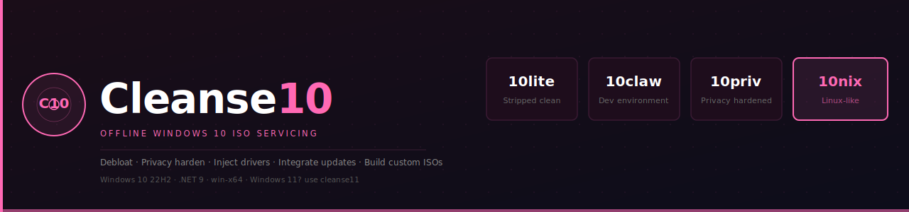

<p align="center">
  
</p>

<p align="center">
  
  
  
  
  
</p>

---

Cleanse10 is a Windows-only offline ISO servicing tool. Point it at an `install.wim` or `install.esd`, pick a preset, and it debloats, hardens, injects drivers, integrates updates, and optionally rebuilds a bootable ISO — all without ever booting the target image.

> [!IMPORTANT]
> **Windows 11?** Cleanse10 targets **Windows 10 22H2** exclusively.
> Applying it to a Windows 11 image will produce a broken result — the bloatware lists, registry paths, and optional feature names differ significantly between OS versions.
> For Windows 11 offline servicing use **cleanse11** instead.

---

## Presets

| Preset | Tagline | What it does |
|---|---|---|
| **10lite** | Stripped clean. Nothing extra. | Base debloat — removes telemetry, Cortana, Xbox, OneDrive stub, consumer bloatware. Every other preset starts here. |
| **10claw** | Built to run and build OpenClaw. | 10lite + Git, CMake, VS Build Tools 2022 (C++ workload, Windows 10 SDK), VC++ redistributables, Developer Mode. First-boot script installs the full OpenClaw build chain. |
| **10priv** | Your data stays yours. | 10lite + aggressive privacy hardening: 35 extra registry tweaks, 5 extra service disables, scheduled telemetry task kills, and a telemetry host blocklist appended to `hosts` at first boot. |
| **10nix** | Windows that thinks like Linux. | 10lite + WSL2 features enabled offline, then a first-boot script that installs Ubuntu 24.04, GlazeWM, YASB, WezTerm, Firefox, scoop CLI tools, JetBrains Mono Nerd Font, and configures dark mode, a hidden taskbar, and the High Performance power plan. |

---

## How It Works

Every preset runs through the same 7-phase pipeline against the mounted image:

```
Phase 1  Remove bloatware AppX packages       (BloatwareManager)
Phase 2  Remove optional Windows features     (ComponentManager)
  2b     Enable optional features             (10nix: WSL2 features)
Phase 3  Apply offline registry tweaks        (OfflineTweaks10 + TweakApplicator)
Phase 4  Inject drivers                       (DriverManager)          — optional
Phase 5  Integrate updates (.msu / .cab)      (UpdateIntegrator)       — optional
Phase 6  Write unattend.xml                   (UnattendedGenerator)    — optional
Phase 7  Write first-boot script + RunOnce    (per-preset setup)
```

Phases 4–6 are skipped if the corresponding folder/config is not supplied. The WIM is mounted and unmounted by the caller (GUI or CLI); `PresetRunner10` operates purely on the directory tree.

---

## Prerequisites

| Requirement | Notes |
|---|---|
| Windows 10 or 11 (host) | Must run as **Administrator** — DISM and registry hive load/unload require elevation |
| .NET 9 SDK | [dotnet.microsoft.com](https://dotnet.microsoft.com/download/dotnet/9) |
| `dism.exe` | Ships with Windows — must be in `PATH` (it always is on a standard install) |
| `oscdimg.exe` | Required only if you want to rebuild a bootable ISO. Part of the Windows ADK. |

---

## Building from Source

```powershell
# Clone
git clone https://github.com/sgauth0/cleanse10.git
cd cleanse10

# Build everything
dotnet build Cleanse10.sln

# Publish GUI (single-file, self-contained)
dotnet publish src\Cleanse10.GUI\Cleanse10.GUI.csproj --configuration Release --output publish

# Publish CLI
dotnet publish src\Cleanse10.CLI\Cleanse10.CLI.csproj --configuration Release --output publish
```

Or use the helper script:

```powershell
.\publish-gui.ps1
```

---

## Quick Start — GUI

1. **Launch** `Cleanse10.exe` as Administrator.
2. **Get ISO** — use the built-in downloader to fetch the official Windows 10 22H2 ISO from Microsoft via Fido, or point to one you already have.
3. **Select a preset** — hover each card to read the full Removes / Adds list.
4. **Start Build** — the dialog lets you set a hostname, toggle AFK (unattended) install, and configure an admin account before committing.
5. Watch the live log. When complete the serviced `install.wim` (and optional ISO) are written to your chosen output path.

---

## CLI Reference

All commands require elevation (`Run as Administrator`).

### `run` — apply a preset end-to-end

```
cleanse10 run --preset <lite|claw|priv|ux>
              --wim    <path\to\install.wim>
              --mount  <empty-dir>
             [--index   <N>]          # WIM image index, default 1
             [--output  <path.iso>]   # rebuild bootable ISO when done
             [--drivers <dir>]        # folder of .inf driver packages
             [--updates <dir>]        # folder of .msu / .cab updates
```

**Example — build a privacy-hardened ISO:**

```powershell
cleanse10 run --preset priv `
              --wim    D:\sources\install.wim `
              --mount  C:\mnt `
              --index  6 `
              --output C:\out\win10priv.iso `
              --drivers C:\drivers\network
```

### `info` — list editions in a WIM

```
cleanse10 info --wim <path\to\install.wim>
```

### `mount` / `unmount` — manual WIM operations

```
cleanse10 mount   --wim <file> --mount <dir> [--index N]
cleanse10 unmount --mount <dir> [--discard]
```

`--discard` throws away all changes; default is to commit.

### `presets` — list all available presets

```
cleanse10 presets
```

---

## Project Structure

```
cleanse10/
├── Cleanse10.sln
└── src/
    ├── Cleanse10.Core/          # All business logic — no WPF, no Console
    │   ├── Bloat/               # BloatwareList10, BloatwareManager, HiveManager, OfflineTweaks10
    │   ├── Components/          # ComponentManager  (DISM feature remove/enable)
    │   ├── Drivers/             # DriverManager
    │   ├── Imaging/             # WimManager, IsoBuilder, DismService
    │   ├── Media/               # Win10DownloadService  (Fido + ISO extraction)
    │   ├── Presets/             # Preset10 enum, PresetCatalog, PresetRunner10, BuildOptions
    │   ├── Tweaks/              # TweakDefinition, TweakCatalog, TweakApplicator
    │   ├── Unattended/          # UnattendedConfig, UnattendedGenerator
    │   └── Updates/             # UpdateIntegrator
    ├── Cleanse10.GUI/           # WPF MVVM app (thin shell over Core)
    │   ├── Themes/Theme.xaml    # Pink / white palette (#FF69B4 accent)
    │   ├── ViewModels/          # MainViewModel, BuildOptionsViewModel, GetIsoViewModel
    │   └── Views/               # MainWindow, BuildOptionsDialog, GetIsoWindow
    └── Cleanse10.CLI/           # System.CommandLine console app (thin shell over Core)
        └── Program.cs
```

---

## Architecture Notes

- **`Cleanse10.Core` is UI-agnostic** — no WPF references, no `Console.*` calls. Both GUI and CLI are thin shells.
- **`PresetRunner10`** orchestrates the 7-phase pipeline. Keep new phases consistent with the `[Preset] Phase X/7` progress prefix.
- **`HiveManager`** is the canonical offline-registry abstraction. Never load/unload hives ad-hoc with `reg.exe` outside of it.
- **Claw / Priv / Nix setup** — operations that require a live session (WSL install, winget, task disable) belong in the first-boot `RunOnce` PowerShell script, not in the offline phase.
- **WIM copy from virtual DVD** — `Win10DownloadService` uses `FileStream(useAsync: false)` (no `FILE_FLAG_OVERLAPPED`) to reliably read from virtual ISO mounts, which do not support overlapped I/O.
- **Windows 11 is a non-goal** — bloatware package names, registry paths, optional feature names, and the OOBE flow differ significantly. Use **cleanse11** for Win11.

---

## Contributing

1. Fork and branch from `main`.
2. Keep business logic in `Cleanse10.Core`; keep GUI and CLI as thin shells.
3. Follow the code style in `AGENTS.md` — file-scoped namespaces, `_camelCase` fields, `PascalCase` methods, async suffix, no `async void` outside event handlers.
4. No automated tests exist yet — run `.\test-launch.ps1` (smoke test) and do a manual build against a real WIM before opening a PR.
5. Open an issue first for anything beyond a small bugfix.

---

## License

MIT — see [LICENSE](LICENSE) for details.
